<div align="center">


# OpenViewer

**Remote Access and AI-Powered Vision**

[English](README.md) | [Tiếng Việt](README_vi.md)

[](#)
[](#download)
[](https://github.com/sonnvntu/openviewer-releases/releases/latest)

</div>

---

## ✨ About

**OpenViewer** is an AI-powered platform that brings together remote access, camera monitoring, and intelligent automation.

### Key Features

- 🖥️ **Remote Access** — View and control any computer from anywhere
  - Low-latency, high-FPS screen streaming.
  - Multi-monitor navigation and management.
  - High-performance screen & audio capture via DXGI (Windows), ScreenCaptureKit (macOS), and X11/Wayland/PipeWire (Linux).
  - High-performance, secure file transfer.
- 📹 **AI-Powered Vision** — Transform cameras into intelligent sensors.
  - Support CPU and GPU acceleration via Vulkan.
  - Deploy custom AI models trained for your specific use cases.
  - Detect people, fire, vehicles, and other critical events.
  - Enhance confidence with multi-stage Detection and Classification pipelines.
  - Create visual AI workflows: Detection → Classification → Rule → Alert.
  - Trigger real-time notifications and automated responses.
- 🔒 **End-to-End Encrypted** — P2P connection with DTLS encryption
- 📱 **Cross-Platform** — Windows, Linux, macOS, Android, iOS
- 🌐 **No Port Forwarding** — Works behind NAT with STUN/TURN relay
- 🔔 **Push Notifications** — AI event alerts delivered to your phone

---

## 🚀 Quick Start

Get started with **OpenViewer** in three simple steps:

### 1. Download OpenViewer
Download the latest client or host installer for your platform from the [GitHub Releases](https://github.com/sonnvntu/openviewer-releases/releases/latest) page.
* Available for Windows, Linux, macOS, Android, and iOS.

### 2. Run and Setup
* **On the Host computer**: Run the OpenViewer Host application to enable remote access and start configuring AI-Powered Vision features.
* **On the Client device**: Open the OpenViewer app (Desktop or Mobile) to connect.

### 3. Connect & Control
* Log in with your account or use the generated connection ID to establish a secure P2P remote session.
* Configure your cameras and start deploying AI models directly from the dashboard.

---

## 📦 Installation Guide

### 🪟 Windows
1. Download the `openviewer-windows-x64.zip` or `.exe` from [Releases](https://github.com/sonnvntu/openviewer-releases/releases/latest).
2. Extract the ZIP file (if downloaded) or run the installer `.exe`.
3. Open `OpenViewer.exe` to start.

### 🐧 Linux
1. Download the `openviewer-linux-x64.AppImage` (or `OpenViewer-v1.0.1-linux-amd64.deb` package).
2. For **AppImage**:
   * Right-click the file, go to **Properties** -> **Permissions** -> check **Allow executing file as program**.
   * Or run the following command in your terminal:
     ```bash
     chmod +x openviewer-linux-x64.AppImage
     ./openviewer-linux-x64.AppImage
     ```
3. For **DEB** (Debian/Ubuntu):
   ```bash
   # Install
   sudo apt install ./OpenViewer-v1.0.1-linux-amd64.deb

   # Reinstall
   sudo apt install --reinstall ./OpenViewer-v1.0.1-linux-amd64.deb
   ```

### 🍎 macOS
1. Download the `openviewer-macos-x64.dmg` (or arm64 for Apple Silicon).
2. Double-click the `.dmg` file and drag **OpenViewer** to your **Applications** folder.
3. If you get a "Developer cannot be verified" warning:
   * Go to **System Settings** > **Privacy & Security**.
   * Scroll down and click **Open Anyway**.

### 🤖 Android (APK)
1. Download the `openviewer-android.apk` file on your device.
2. Open the downloaded file. If prompted, enable **"Install from Unknown Sources"** in settings.
3. Tap **Install** and open the app.

---

## 📸 Screenshots

### 💻 Desktop App
<div align="center">
  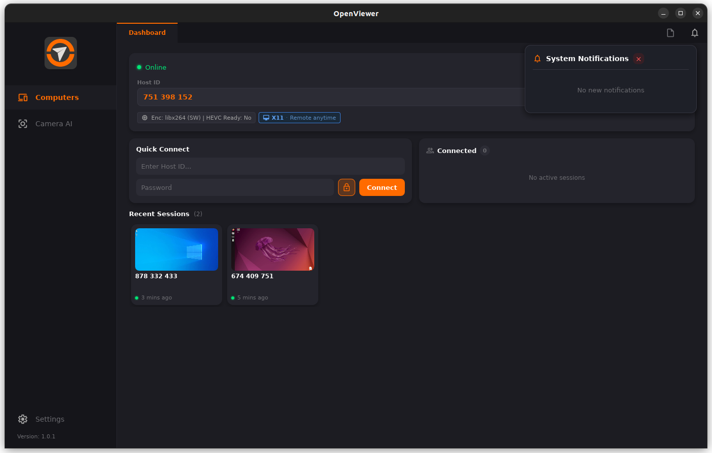
</div>
<div align="center" style="margin-top: 10px;">
  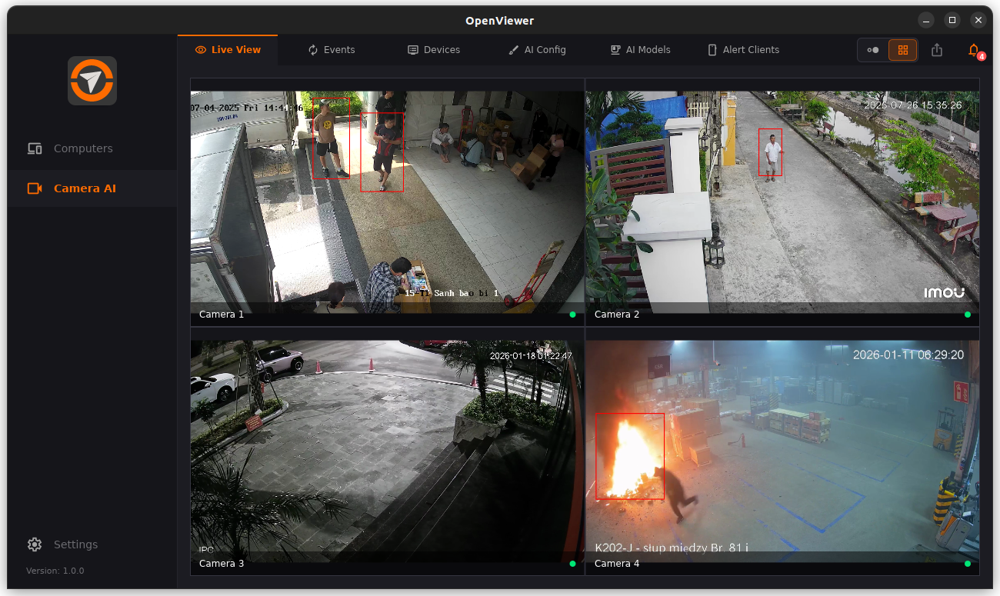
  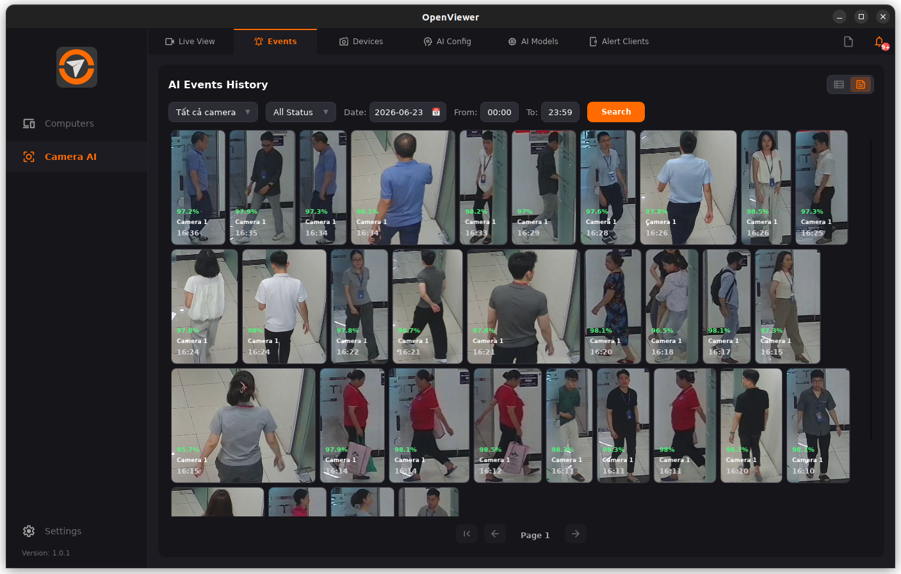
</div>
<div align="center" style="margin-top: 10px;">
  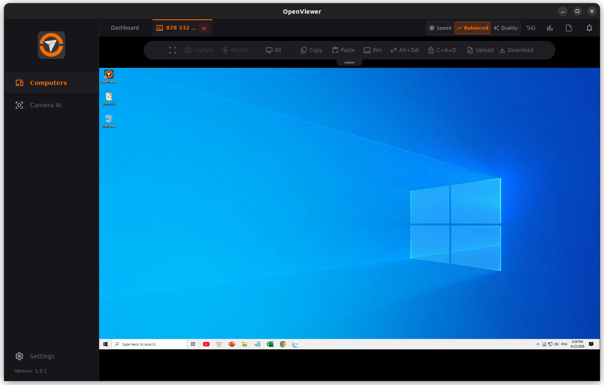
  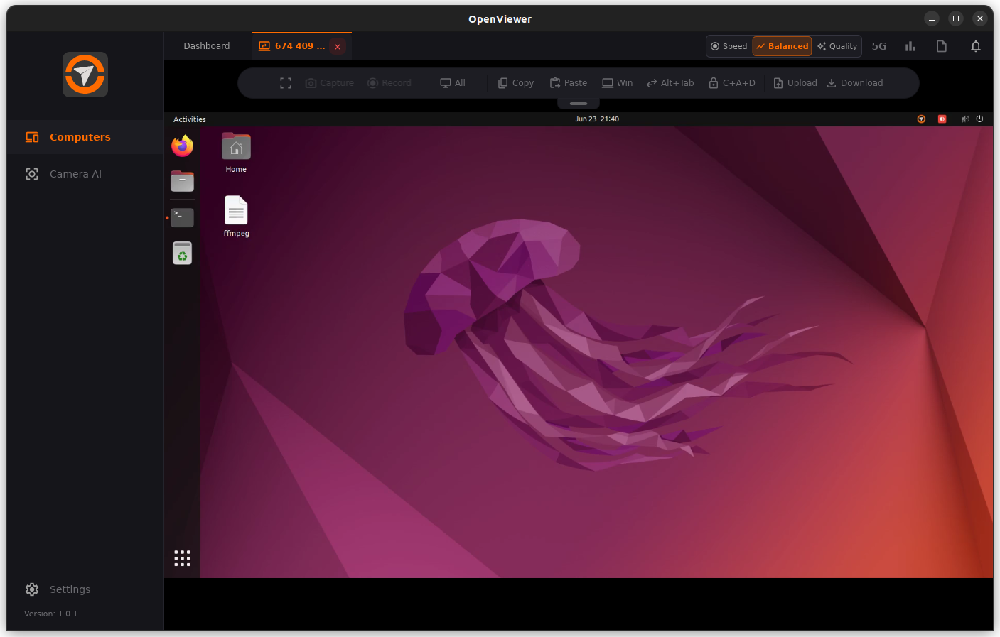
</div>

### 📱 Mobile App
<div align="center">
  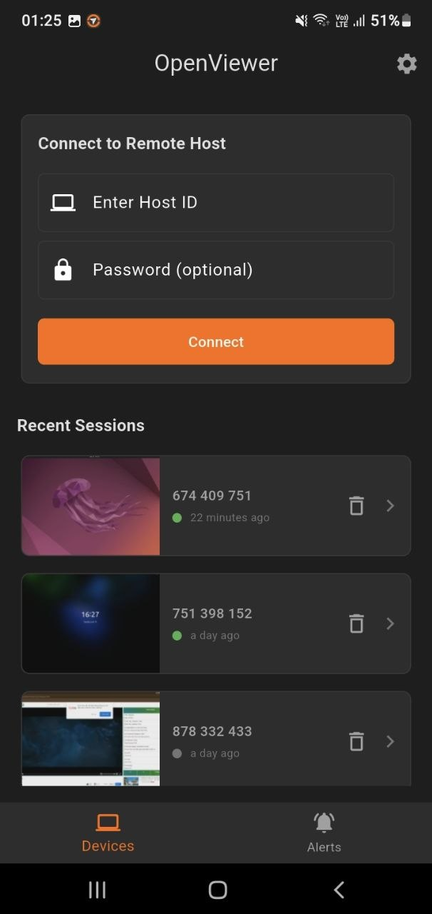
  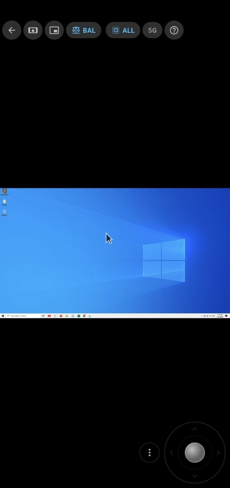
  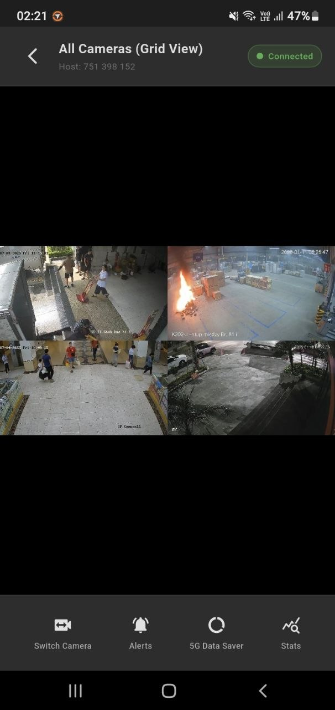
</div>
<div align="center" style="margin-top: 10px;">
  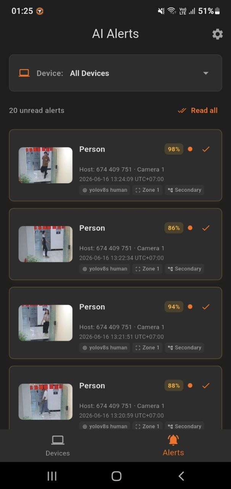
  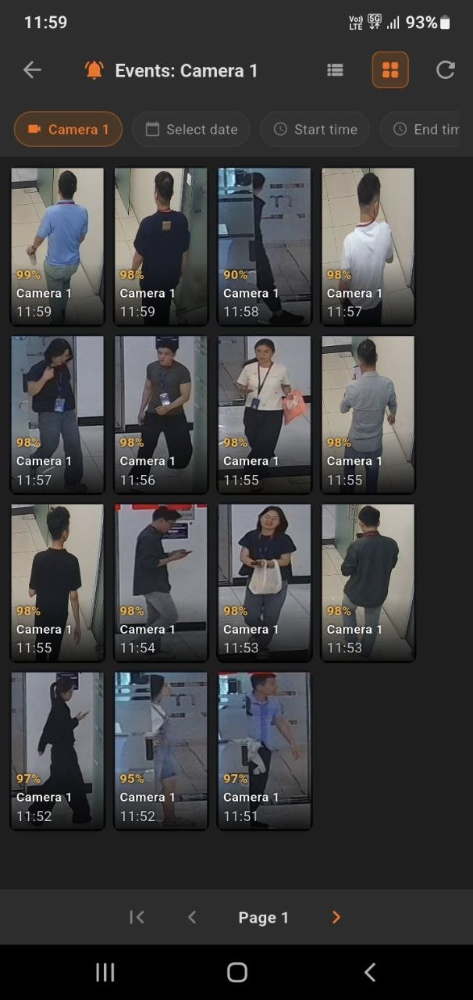
  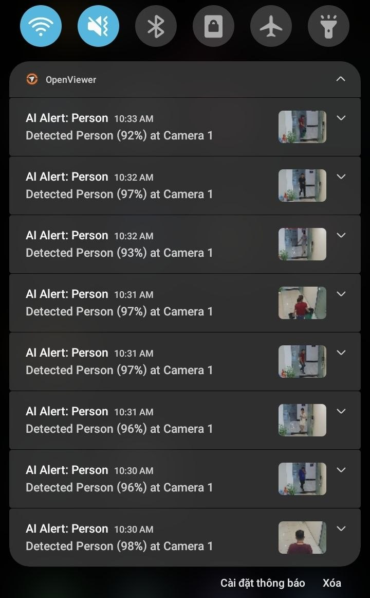
</div>

---

</div>
