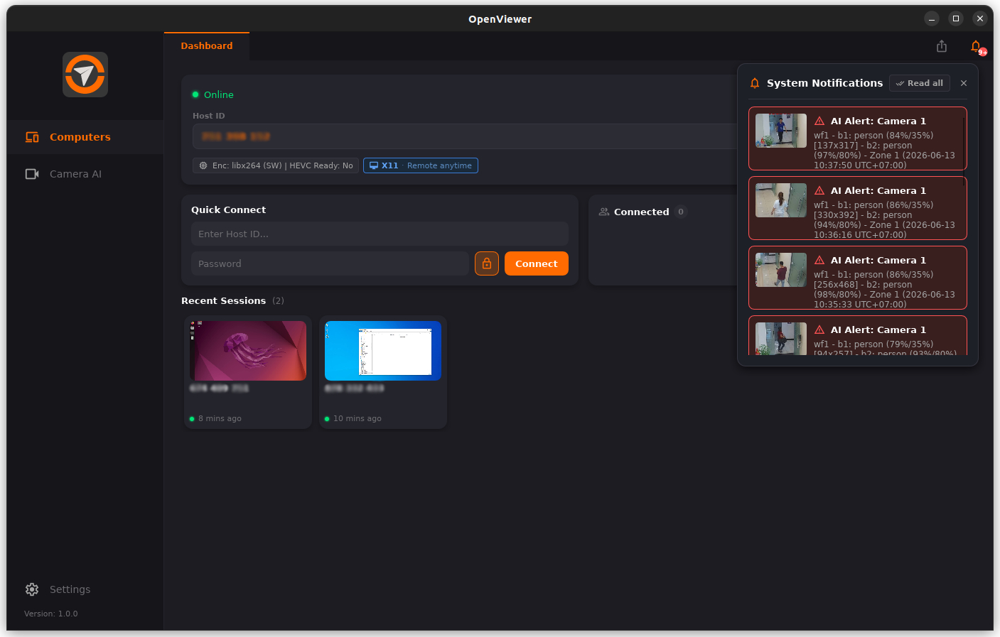

# OpenViewer

**Truy Cập Từ Xa Và Camera Thông Minh AI**

[English](README.md) | [Tiếng Việt](README_vi.md)

---

## ✨ Giới thiệu

**OpenViewer** là nền tảng hỗ trợ bởi AI, kết hợp tính năng truy cập từ xa, giám sát camera và tự động hóa thông minh.

### Tính năng chính

- 🖥️ **Truy cập từ xa** — Xem và điều khiển bất kỳ máy tính nào từ mọi nơi
  - Truyền phát màn hình độ trễ thấp và FPS cao.
  - Điều hướng và quản lý nhiều màn hình cùng lúc.
  - Capture màn hình và âm thanh hiệu năng cao qua DXGI (Windows), ScreenCaptureKit (macOS) và X11/Wayland/PipeWire (Linux).
  - Truyền tệp tốc độ cao và bảo mật.
- 📹 **AI-Powered Vision** — Biến camera thành các cảm biến thông minh.
  - Triển khai các mô hình AI tùy chỉnh được huấn luyện riêng cho nhu cầu của bạn.
  - Phát hiện người, đám cháy, phương tiện và các sự kiện quan trọng khác.
  - Tăng cường độ tin cậy với chuỗi xử lý (pipeline) Phát hiện & Phân loại đa tầng.
  - Thiết lập luồng công việc AI trực quan: Phát hiện → Phân loại → Luật → Cảnh báo.
  - Kích hoạt thông báo thời gian thực và các phản hồi tự động.
- 🔒 **Mã hóa đầu cuối** — Kết nối P2P được bảo mật bằng mã hóa DTLS
- 📱 **Đa nền tảng** — Windows, Linux, macOS, Android, iOS
- 🌐 **Không cần cấu hình cổng (Port Forwarding)** — Hoạt động tốt sau mạng NAT nhờ hệ thống STUN/TURN relay
- 🔔 **Thông báo đẩy** — Gửi trực tiếp các cảnh báo sự kiện AI đến điện thoại của bạn

---

## 📸 Giao diện ứng dụng

### 💻 Ứng dụng Desktop

  
  

### 📱 Ứng dụng Di động

  
  
  

---

